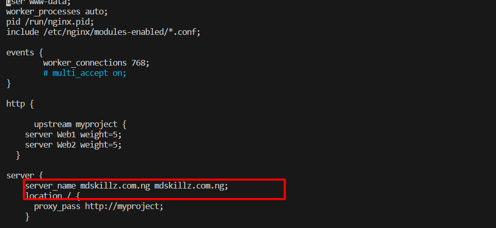

# LOAD BALANCER SOLUTION WITH NGINX AND SSL/TLS

## OBJECTIVE

To implement a Nginx load balancer based on HTTPS and create a domain name for our webservers.

### Creating and configuring the Nginx as a Load Balancer

### Steps

1. Create a new EC2 VM on Ubuntu server.
2. Create an inbound rule for HTTPS(port 8) and HTTPS( Port 443).
3. Update the `/etc/hosts` to the Webservers name as shown below
    
4. Update your instance and install Nginx.

        sudo apt update
        sudo apt install nginx
5. Configure Nginx LB using the Webservers name defined in `/etc/hosts` in step 3 by inserting the code configuration below into the HTTP section of `/etc/nginx/nginx.conf`.

        upstream myproject {
        server Web1 weight=5;
        server Web2 weight=5;
       }

        server {
        listen 80;
        server_name www.domain.com;
        location / {
        proxy_pass http://myproject;
        }
       }
6. In the `/etc/nginx/ngnix.conf` comment out the line below as we do not intend to use our Nginx as a webserver but a load balancer.

        include /etc/Nginx/sites-enabled/*;

   

7. Restart and confirm the status of Nginx.

        sudo systemctl restart nginx
        sudo systemctl status nginx

### Registering A new Domain Name and Assigning an Elastic IP to the Nginx server

### Steps

1. In order to get a valid SSSL certificate, I registered a new domain name `www.mdskillz.com.ng` using `www.hostafrica.com` as the provider.
        
2. The next step is to create a Elastic IP and link it to the Nginx Server. This ensure that the IP of our server does not change even after the server is stopped or restarted. The is done with the following steps: 

    - Navigate to the Elastic IP section in on the AWS console

        
    - Click on the Allocate Elastic IP address button
    - Leave the defaults and select allocate
    - upon creation, select associate Elastic IP and select the instance you want to assign the IP to, in our case, our Nginx server.
3. Next step is to direct the traffic from our elastic IP to the created domain name.

    - visit the route 53 console [route53](console.aws.amazon.com/route53/v2/hostedzones#).
    - Click on the create hosted zone menu
       
    - Fill the required details as shown below
      

    - Copy the record from the created hosted names in step 3 and replace same with the nameservers on the registered domain console.
       
       

4. update the `/etc/nginx/nginx.conf` by replacing the server_name with the newly registered domain
      
5. Access the website with the elastic IP.

### Securing the website

1. Install certbot and request for an SSL/TLS certificate
2. Make sure snapd service is active and running by running:

        sudo systemctl status snapd
    

3. Install certbot with the command below

        sudo snap install --classic certbot
4. Use the command below to request for certificate and follow the prompt.

        sudo ln -s /snap/bin/certbot /usr/bin/certbot
        sudo certbot --nginx
5. upon completion, re-access the webpage using the HTTPS protocol